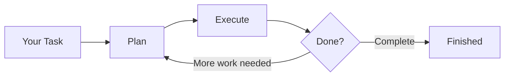
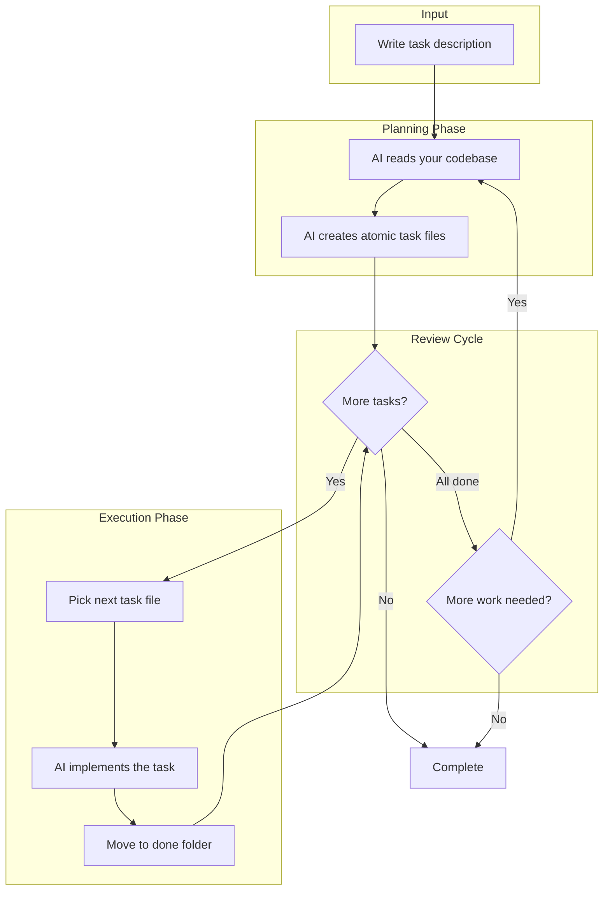

# McGravity

<div align="center">
  
</div>

**Fast, opinionated TUI for AI-assisted coding.**

McGravity orchestrates AI coding tools (Claude Code, Codex, Gemini) in a tight feedback loop: **plan small tasks → execute one at a time → review → replan**. Instead of dumping a huge prompt and hoping for the best, McGravity breaks your work into atomic pieces that are easier to verify and course-correct.

```
+------------------------------------------------------------+
| McGravity                                    [Claude Code] |
+--------------------------- Output -------------------------+
| > Planning complete                                        |
| > Executing task-001.md...                                 |
| + Created src/auth/login.rs                                |
| + Updated src/main.rs                                      |
+------------------------------------------------------------+
| Iteration #1 | Executing | task-001.md                    |
+------------------------------------------------------------+
| [##########-----] 1/3 tasks                                |
+--------------------------- Task ---------------------------+
| Add user authentication with JWT tokens.                   |
| Reference @src/auth/ for existing patterns.                |
+------------------------------------------------------------+
| [Esc] Cancel  [Ctrl+S] Settings                            |
+------------------------------------------------------------+
```

## How It Works

McGravity runs a continuous improvement loop:



## Quick Start

### 1. Install McGravity

```bash
# bun, npm, pnpm, yarn, etc.
npm install -g mcgravity
```

### 2. Install an AI CLI

McGravity needs at least one AI coding tool installed:

| Tool            | Install Command                            | Documentation                                |
| --------------- | ------------------------------------------ | -------------------------------------------- |
| **Claude Code** | `npm install -g @anthropic-ai/claude-code` | [claude.ai/code](https://claude.ai/code)     |
| **Codex**       | `npm install -g @openai/codex`             | [openai.com/codex](https://openai.com/codex) |
| **Gemini CLI**  | `npm install -g @google/gemini-cli`        | [ai.google.dev](https://ai.google.dev)       |

### 3. Run McGravity

```bash
cd your-project
mcgravity
```

On first run, McGravity will detect available AI tools and ask you to choose which to use for planning and execution.

### 4. Describe Your Task

Type what you want to build or fix:

```
Add a /health endpoint that returns JSON with status and uptime.
Check @src/routes/ for existing patterns.
```

Press `Enter` to start the flow.

## Installation Options

### Install Script (Recommended)

The install script automatically detects your OS and architecture:

```bash
# bun, npm, pnpm, yarn, etc.
npm install -g mcgravity
```

### GitHub Releases

Download the latest release for your platform from [GitHub Releases](https://github.com/tigranbs/mcgravity/releases), extract, and add to your PATH.

### Build from Source

```bash
git clone https://github.com/tigranbs/mcgravity.git
cd mcgravity
cargo install --path .
```

## Usage Guide

### Writing Task Descriptions

Good task descriptions are specific and reference relevant files:

```
Add input validation to the user registration form.
- Email must be valid format
- Password minimum 8 characters
- Show error messages inline
Check @src/components/RegisterForm.tsx for the component.
```

**Tips:**

- Be specific about what you want
- Reference files with `@` mentions
- List acceptance criteria
- Mention constraints (e.g., "don't add new dependencies")

### @ File Mentions

Type `@` followed by a filename to search your project:

```
Update @src/config.ts to add the new API endpoint.
```

- **Fuzzy search**: `@config` finds `src/config.ts`
- **Navigation**: Use `Up/Down` or `j/k` to select
- **Insert**: Press `Tab` or `Enter` to insert the path
- **Cancel**: Press `Esc` to dismiss

Files matching `.gitignore` patterns are excluded from suggestions.

### Slash Commands

Type `/` at the start of a line to see available commands:

| Command     | Description                        |
| ----------- | ---------------------------------- |
| `/settings` | Open settings panel                |
| `/clear`    | Clear task, output, and todo files |
| `/exit`     | Exit McGravity                     |

### Settings

Press `Ctrl+S` to open settings:

| Setting             | Options                | Description                     |
| ------------------- | ---------------------- | ------------------------------- |
| **Planning Model**  | Claude, Codex, Gemini  | AI tool for breaking down tasks |
| **Execution Model** | Claude, Codex, Gemini  | AI tool for implementing tasks  |
| **Enter Behavior**  | Submit / Newline       | What `Enter` does in the input  |
| **Max Iterations**  | 1, 3, 5, 10, Unlimited | How many plan→execute cycles    |

Settings are saved automatically to `.mcgravity/settings.json`.

## Key Bindings

### Global

| Key      | Action                               |
| -------- | ------------------------------------ |
| `Ctrl+S` | Open settings                        |
| `Ctrl+C` | Quit                                 |
| `Esc`    | Cancel running flow / Quit when idle |

### Text Input

| Key           | Action                                           |
| ------------- | ------------------------------------------------ |
| `Enter`       | Submit task (default) or newline (if configured) |
| `Ctrl+Enter`  | Always submits                                   |
| `Ctrl+J`      | Always inserts newline (works on all terminals)  |
| `Shift+Enter` | Insert newline                                   |
| `@`           | Open file search                                 |
| `/`           | Open command menu (at line start)                |

### Output Panel

| Key               | Action             |
| ----------------- | ------------------ |
| `Ctrl+Up/Down`    | Scroll output      |
| `PageUp/PageDown` | Page scroll        |
| `Ctrl+Home/End`   | Jump to top/bottom |

### Settings Panel

| Key                | Action           |
| ------------------ | ---------------- |
| `Up/Down` or `j/k` | Navigate options |
| `Enter` or `Space` | Change selection |
| `Esc` or `q`       | Close settings   |

### The Flow in Detail



**Why this approach?**

1. **Focused AI**: Each phase has a single job. The planner only plans. The executor only executes.
2. **Atomic tasks**: Small, verifiable changes. Easy to review, easy to fix if something goes wrong.
3. **Built-in context**: Completed tasks inform the next planning cycle, so the AI knows what's been done.
4. **Controllable**: Cancel anytime with `Esc`. Set max iterations. Review after each cycle.

## File Structure (generated by McGravity)

McGravity creates a `.mcgravity/` folder in your project:

```
.mcgravity/
├── settings.json      # Your preferences
├── task.md            # Current task + completed task references
└── todo/
    ├── task-001.md    # Pending task (created by planner)
    ├── task-002.md    # Pending task
    └── done/
        └── task-001.md    # Completed task (archived)
```

### Task Files

Each task file contains:

```markdown
# Task 001: Add health endpoint

## Objective

Create a /health endpoint returning JSON status.

## Implementation Steps

1. Create route handler in src/routes/health.rs
2. Return JSON with status and uptime fields
3. Register route in src/main.rs

## Reference Files

- src/routes/mod.rs - Add module export
- src/main.rs - Register route

## Acceptance Criteria

- [ ] GET /health returns 200
- [ ] Response includes "status" and "uptime" fields
```

## Troubleshooting

### No AI tools detected

McGravity requires at least one AI CLI tool. Install one:

```bash
npm install -g @anthropic-ai/claude-code  # Claude Code
npm install -g @openai/codex               # Codex
npm install -g @google/gemini-cli          # Gemini
```

Then restart McGravity.

### Keys not working as expected

Some terminals don't report modifier keys correctly. Try:

- Use `Ctrl+J` for newlines (works everywhere)
- Use `j/k` instead of arrow keys for navigation

Enable debug mode to see what your terminal sends:

```bash
MCGRAVITY_DEBUG_KEYS=1 mcgravity
```

### Multi-line input

Several methods to insert newlines:

| Method           | How                               |
| ---------------- | --------------------------------- |
| `Ctrl+J`         | Works on all terminals            |
| `Shift+Enter`    | Standard (may not work on iPad)   |
| `\` then `Enter` | Backslash escape                  |
| Settings         | Set "Enter Behavior" to "Newline" |

### Flow not progressing

1. Check the output panel for error messages
2. Verify your AI CLI is authenticated (`claude --help`, `codex --help`)
3. Try reducing max iterations to 1 for debugging
4. Cancel with `Esc` and try a simpler task

## Privacy

McGravity runs AI CLI tools locally on your machine. It never collects, stores, or transmits your code or API keys. Configure authentication directly in the AI CLI tools you use.

## License

MIT

---

**Built with Rust + Ratatui** by [@tigranbs](https://github.com/tigranbs)

[Report Issues](https://github.com/tigranbs/mcgravity/issues) · [Releases](https://github.com/tigranbs/mcgravity/releases)
